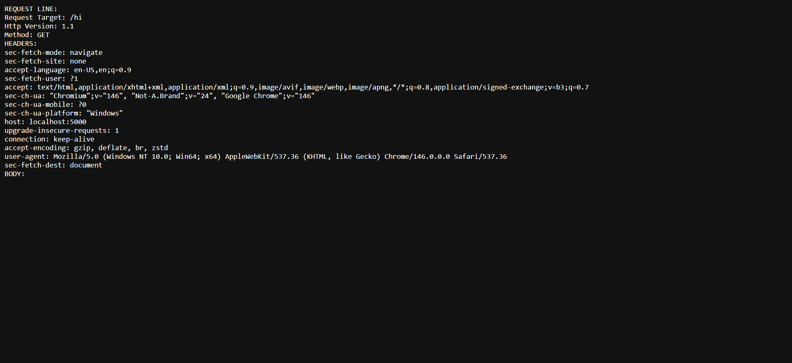

# Java HTTP Server

A lightweight HTTP server written from scratch in Java.  
The server handles HTTP requests, parses request lines and headers, routes endpoints, and generates responses without using any web framework.

This project was built to better understand how web servers, networking, and the HTTP protocol work internally.

---

# Screenshots
## Regular Endpoint:


## Special Endpoint:


---

# Running the Server

## Run with Docker

```bash
mvn clean package
docker build -t imagename:tag .
docker run -p 5000:5000 imagename:tag

Once running, open:

http://localhost:5000
Run with Maven
mvn clean package
java -jar target/httpserver-1.0-SNAPSHOT.jar

Then visit:

http://localhost:5000
Project Links

Home Page:

/static/index.html
```


# Features

- Custom HTTP request parser
- Routing system for endpoints
- Special endpoints such as:
  - `/httpbin/*`
  - `/video/*`
  - `/static/*`
- Static file serving
- Multithreaded request handling

---

# Special Endpoints

There are three main types of special endpoints implemented by the server.

### `/httpbin/stream/n`

Example:


/httpbin/stream/5


This endpoint sends a proxy request to:


https://httpbin.org


The server then returns the response using chunked transfer encoding.

The maximum value the server comfortably handles is roughly `~30`.

---

### `/video/*`

Examples:


/video/vim
/video/brunson


These endpoints return video files stored inside the server.  
Currently the videos are read fully into memory and then sent to the client.

---

### `/static/*`

Examples:


/static/index.html
/static/about.html


These endpoints serve static HTML files stored within the server.  
Like the video endpoints, the files are read into memory and then written to the response.

---

# Design

The architecture of this server was designed to emulate the style of modern web servers and frameworks such as:

- NGINX
- Spring Boot

For example, NGINX uses a predefined configuration file called `mime.types` that maps file extensions to MIME types.  
This project implements a similar concept by using a static map inside the `StaticFileEndpoint` class to determine the appropriate MIME type for files.

---

## Request Flow

The request lifecycle flows through three main components:


Server → ResponseHandler → ResponseWriter


### Server
- Accepts incoming socket connections
- Delegates HTTP parsing to a request parser

### ResponseHandler
- Interprets the request
- Handles routing logic
- Dispatches special endpoints

### ResponseWriter
- Writes the HTTP response bytes to the output stream

---

## Routing

Users can define their own endpoints using a router map.

Example endpoints included in the project:


/yourproblem → returns HTTP 400
/myproblem → returns HTTP 500


---

## Special Endpoint Registry

Special endpoints are managed through a `SpecialEndpointRegistry` class.

This registry is configured during server startup and allows the server to dynamically determine which handler should process specific endpoint patterns.
